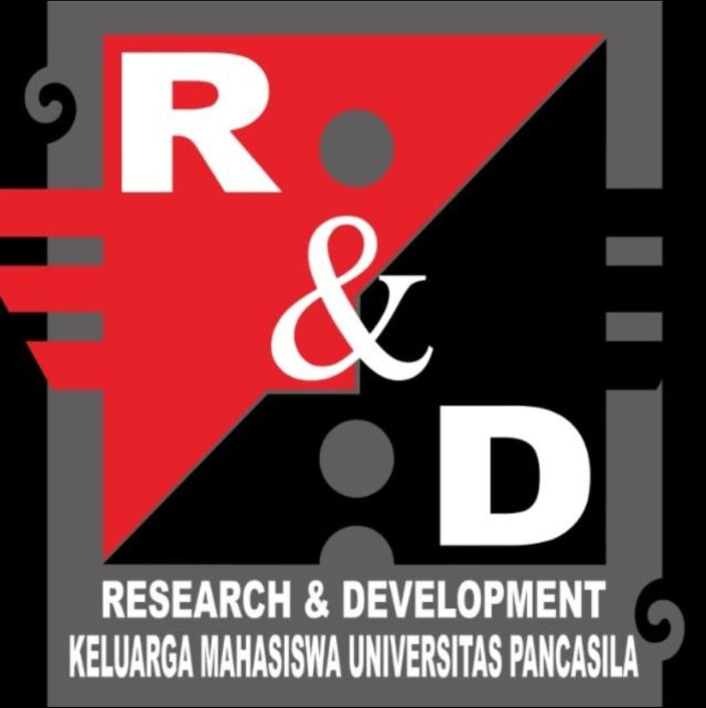
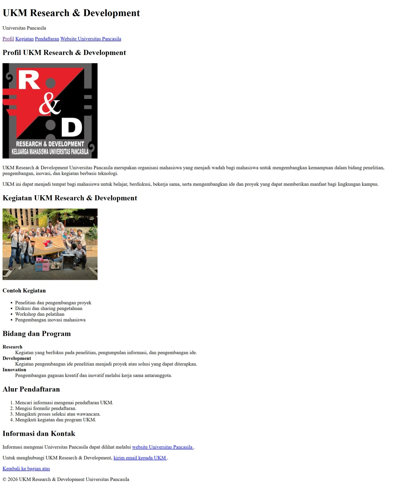

# Profil UKM Research & Development Universitas Pancasila

## Penulis

Dibuat oleh **Tazkia Putri Arsyad**, mahasiswa Teknik Informatika Universitas Pancasila.

**NPM:** 4525210073

## Deskripsi Singkat

Proyek ini merupakan halaman web sederhana yang dibuat menggunakan HTML untuk memperkenalkan UKM Research & Development Universitas Pancasila.

Halaman web ini berisi informasi mengenai profil UKM, kegiatan, bidang dan program, alur pendaftaran, serta informasi dan kontak.

## Struktur Halaman

### 1. Header

Bagian header merupakan bagian paling atas halaman yang berisi judul website, nama Universitas Pancasila, dan navigasi.

Kode yang digunakan:

```html
<header>
    <h1 id="beranda">UKM Research & Development</h1>
    <p>Universitas Pancasila</p>
</header>
```

### 2. Navigasi

Navigasi digunakan untuk memudahkan pengguna berpindah ke bagian tertentu pada halaman.

Navigasi menggunakan tag `<nav>` dan `<a>`.

```html
<nav>
    <a href="#profil">Profil</a>
    <a href="#kegiatan">Kegiatan</a>
    <a href="#pendaftaran">Pendaftaran</a>

    <a href="https://www.univpancasila.ac.id/" target="_blank">
        Website Universitas Pancasila
    </a>
</nav>
```

### 3. Profil UKM

Bagian profil berisi penjelasan mengenai UKM Research & Development Universitas Pancasila.

Pada bagian ini digunakan tag `<section>`, `<h2>`, ``, dan `<p>`.

Kode untuk menampilkan gambar:

```html

```

### 4. Kegiatan UKM

Bagian ini berisi beberapa contoh kegiatan yang dilakukan oleh UKM Research & Development.

Kegiatan tersebut antara lain:

- Penelitian dan pengembangan proyek
- Diskusi dan sharing pengetahuan
- Workshop dan pelatihan
- Pengembangan inovasi mahasiswa

Daftar kegiatan dibuat menggunakan tag `<ul>` dan `<li>`.

### 5. Bidang dan Program

Bagian ini menjelaskan bidang dan program yang terdapat dalam UKM.

Bidang yang ditampilkan yaitu:

- **Research**, berfokus pada penelitian, pengumpulan informasi, dan pengembangan ide.
- **Development**, berfokus pada pengembangan ide penelitian menjadi proyek atau solusi.
- **Innovation**, berfokus pada pengembangan gagasan kreatif dan inovatif.

Bagian ini menggunakan tag `<dl>`, `<dt>`, dan `<dd>`.

### 6. Alur Pendaftaran

Bagian ini berisi tahapan pendaftaran UKM, yaitu:

1. Mencari informasi mengenai pendaftaran UKM.
2. Mengisi formulir pendaftaran.
3. Mengikuti proses seleksi atau wawancara.
4. Mengikuti kegiatan dan program UKM.

Daftar tersebut dibuat menggunakan tag `<ol>` dan `<li>`.

### 7. Informasi dan Kontak

Bagian ini berisi link menuju website Universitas Pancasila dan alamat email UKM.

Link website dibuat menggunakan tag `<a>`:

```html
<a href="https://www.univpancasila.ac.id/" target="_blank">
    Website Universitas Pancasila
</a>
```

Link email dibuat menggunakan:

```html
<a href="mailto:ukmrnd@example.com">
    kirim email kepada UKM
</a>
```

### 8. Footer

Footer merupakan bagian paling bawah halaman yang berisi informasi hak cipta.

```html
<footer>
    <p>&copy; 2026 UKM Research & Development Universitas Pancasila</p>
</footer>
```

## Tag HTML yang Digunakan

| Tag | Fungsi |
|---|---|
| `<!DOCTYPE html>` | Menentukan bahwa dokumen menggunakan HTML5 |
| `<html>` | Elemen utama dokumen HTML |
| `<head>` | Menyimpan informasi dokumen |
| `<meta>` | Mengatur informasi dokumen |
| `<title>` | Menentukan judul pada tab browser |
| `<body>` | Menyimpan isi halaman |
| `<header>` | Membuat bagian kepala halaman |
| `<nav>` | Membuat navigasi |
| `<a>` | Membuat link atau tautan |
| `<section>` | Membagi halaman menjadi beberapa bagian |
| `<h1>` - `<h3>` | Membuat judul dan subjudul |
| `<p>` | Membuat paragraf |
| `` | Menampilkan gambar |
| `<ul>` | Membuat unordered list |
| `<ol>` | Membuat ordered list |
| `<li>` | Membuat item list |
| `<dl>` | Membuat description list |
| `<dt>` | Menentukan istilah |
| `<dd>` | Memberikan penjelasan istilah |
| `<footer>` | Membuat bagian bawah halaman |

## Cara Menjalankan

1. Buka folder project di Visual Studio Code.
2. Pastikan file `profil.html` berada di dalam folder project.
3. Pastikan file gambar tersedia di dalam folder project.
4. Buka `profil.html` menggunakan browser.
5. Halaman web akan menampilkan profil UKM Research & Development Universitas Pancasila.

## Hasil Tampilan Website

Berikut merupakan screenshot hasil tampilan halaman web yang telah dibuat menggunakan HTML.



## Kesimpulan

Proyek ini dibuat untuk menerapkan dasar-dasar HTML dalam pembuatan halaman web sederhana. Materi yang diterapkan meliputi struktur dokumen HTML, heading, paragraf, gambar, hyperlink, navigasi, unordered list, ordered list, description list, dan footer.